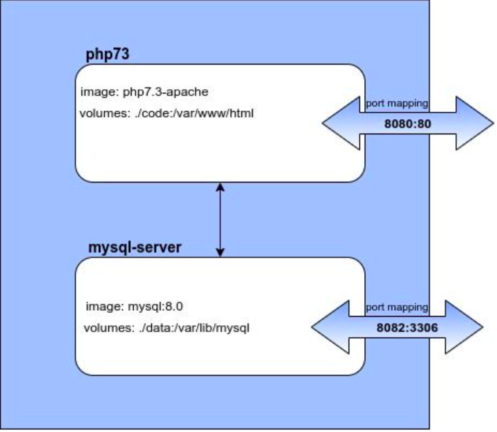

#    (cs518)Cloud services course project:
## Author: Zacharopoulos Apostolos
###
For the purposes of this courses we were asked to create a student managment
platform with a simple frontend view and specific backend: We had to use Mysql
db, apache server and containerize the app with Docker.
Functionality is divided into two services, first service hosts the apache to 
serve http requests and the second hosts the mysql db.You can see more info
in the image below.More details in the yaml file.
1. Build and start the services with **docker-compose up** command 
2. Database can be accessed through docker's interactive terminal:**docker exec -it mysql-server bash -l**

